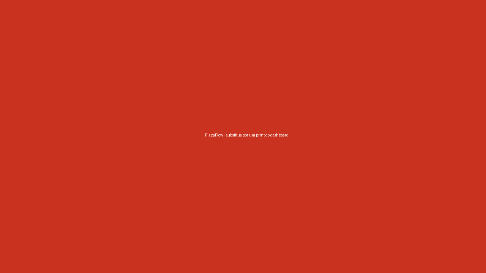
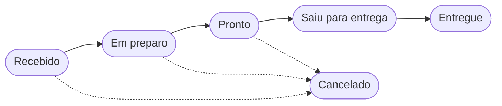
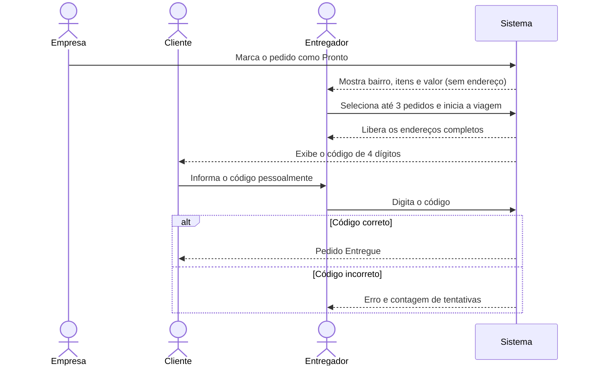
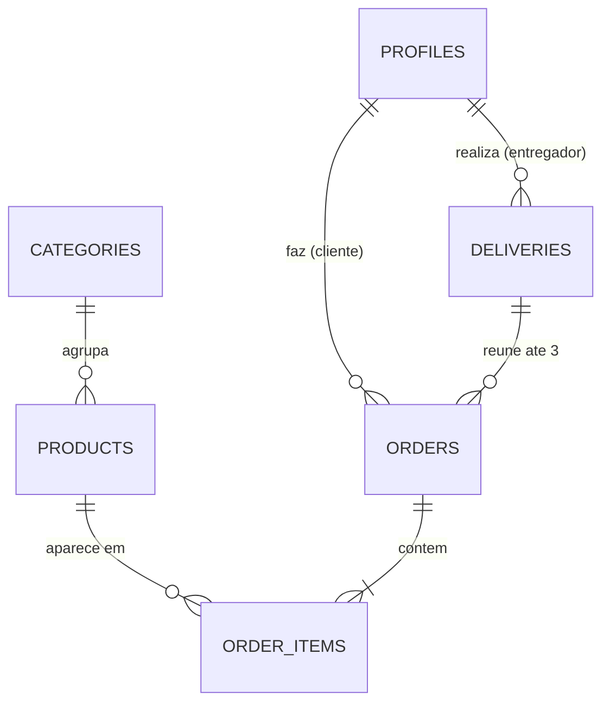

# 🍕 PizzaFlow - Cardápio, Pedidos e Entregas

> Sistema Web para pizzarias de pequeno porte gerenciarem cardápio, pedidos e
> entregas, com painéis para empresa, cliente e entregador e confirmação de
> entrega por código.


-orange)



🔗 **Veja o sistema no ar:** [josehenrique26.github.io/pizzaflow](https://josehenrique26.github.io/pizzaflow/)

---

## Ideia, Objetivo Principal & Público-Alvo

- **Ideia & Objetivo:** Centralizar em um único sistema o cardápio digital, o
  recebimento de pedidos e o controle das entregas de uma pizzaria, sem
  depender de comissões de grandes plataformas de delivery.
- **Público-Alvo:**
  - **Empresa (pizzaria):** donos e atendentes de pizzarias pequenas e
    deliveries locais;
  - **Cliente:** pessoas que desejam pedir pizza de forma rápida e acompanhar o
    andamento do pedido;
  - **Entregador:** profissionais que realizam as entregas da pizzaria.
- **Problema:** Pedidos recebidos por WhatsApp e telefone geram erros de
  anotação, perda de pedidos, cardápios desatualizados, falta de controle sobre
  quem entregou o quê e dificuldade de confirmar que o pedido chegou ao
  cliente. As grandes plataformas resolvem parte disso, mas cobram taxas altas.
- **Solução & Valor:** Interface Web simples com três perfis. A pizzaria
  gerencia o cardápio e o fluxo dos pedidos, o cliente faz o pedido e acompanha
  o status, e o entregador seleciona até 3 pedidos por viagem. A entrega só é
  concluída quando o entregador informa o **código de confirmação** exibido na
  tela do cliente.

### Perfis de usuário

| Perfil | O que pode fazer |
| ------ | ---------------- |
| 🏪 **Empresa** | Gerenciar o cardápio (CRUD), visualizar pedidos, alterar o status até "Pronto", consultar faturamento e histórico. |
| 🛒 **Cliente** | Ver o cardápio, filtrar por categoria, montar o carrinho, finalizar o pedido, acompanhar o status e consultar o código de entrega. |
| 🛵 **Entregador** | Ver apenas pedidos "Prontos", selecionar até 3 por viagem, iniciar a viagem, ver os endereços e confirmar a entrega com o código. |

### Ciclo de vida do pedido



> O cancelamento é possível (pela empresa ou pelo cliente) **antes** de
> "Saiu para entrega".

### Regras do fluxo de entrega

1. Quando a pizzaria marca o pedido como **Pronto**, ele aparece na lista do
   entregador mostrando apenas **bairro, itens e valor**. O endereço completo
   fica oculto.
2. O entregador **seleciona até 3 pedidos** para formar uma viagem. Um pedido
   só pode ser reservado por um entregador (reserva atômica, para que dois
   entregadores não peguem o mesmo pedido).
3. Ao **iniciar a viagem**, os pedidos mudam para **Saiu para entrega**, o
   entregador passa a ver os **endereços completos** e o sistema **gera um
   código de 4 dígitos** para cada pedido.
4. O código aparece **somente na tela do cliente**.
5. No local, o cliente informa o código e o entregador o digita no sistema.
6. Se o código estiver correto, o pedido muda automaticamente para
   **Entregue**. Se estiver incorreto, o sistema exibe erro e **limita as
   tentativas**.
7. O entregador só pode iniciar uma nova viagem quando todos os pedidos da
   viagem atual estiverem **entregues ou cancelados**.

<details>
<summary>📈 Ver o diagrama da confirmação por código</summary>



</details>

---

## Benchmarking (Análise Comparativa)

| Ferramenta | Pontos Fortes | Limitações | Diferencial da Solução |
| ---------- | ------------- | ---------- | ---------------------- |
| iFood | Grande base de clientes e entrega integrada | Comissões altas para o restaurante | Sem comissão e com controle próprio dos clientes |
| Anota AI | Cardápio digital e pedidos via WhatsApp | Foco em atendimento, pouca gestão de entregas | Controle da viagem do entregador e confirmação por código |
| Goomer | Cardápio digital e gestão de pedidos | Planos pagos e funcionalidades amplas demais | Interface enxuta voltada a pizzarias pequenas |
| Cardápio Web | Painel completo para o lojista | Curva de aprendizado e custo mensal | Fluxo simples com três perfis bem definidos |

---

## Equipe

- **Eric Fabrício Dantas Linhares** - 202614320012 | [GitHub](https://github.com/ericfabricio7) | [LinkedIn](https://www.linkedin.com/in/eric-fabricio/)
- **Gabriel Leite Cavalcanti de Albuquerque** - 202614320027 | [GitHub](https://github.com/leitecavalcanti-lab) | [LinkedIn](https://www.linkedin.com/in/PREENCHER/)
- **José Henrique de Sousa Leite** - 202614320021 | [GitHub](https://github.com/josehenrique26) | [LinkedIn](https://www.linkedin.com/in/jos%C3%A9-henrique-de-sousa-leite-b861463b4)
- **Mateus Menezes de Souza** - 202614320031 | [GitHub](https://github.com/mateussmenezes) | [LinkedIn](https://www.linkedin.com/in/mateus-menezes-705782406/)

---

## Documentação & Recursos

- **Pitch / Apresentação:** [PREENCHER: link dos slides da proposta]
- **Protótipos / Design:** [Ver protótipos](docs/prototypes/) | [Figma](https://www.figma.com/make/O4jmNIXp7j0otHUTHx6u82/PizzaFlow-Web-App-Design)
- **Workflow / Kanban:** [GitHub Projects](https://github.com/users/josehenrique26/projects/2)
- **Documentação do Projeto:** [Ver pasta de documentação](docs/)
  - [Modelo de dados](docs/data-model.md)
  - [Regras da viagem e do código de entrega](docs/delivery-flow.md)

---

## Páginas / Telas da Aplicação (GitHub Pages)

**Índice**

- 🏠 **Índice / Home:** [https://josehenrique26.github.io/pizzaflow/](https://josehenrique26.github.io/pizzaflow/)

**Acesso**

- 🔑 **Login:** [login.html](https://josehenrique26.github.io/pizzaflow/screens/auth/login.html)
- 📝 **Cadastro:** [register.html](https://josehenrique26.github.io/pizzaflow/screens/auth/register.html)

**Cliente**

- 🍕 **Cardápio:** [menu.html](https://josehenrique26.github.io/pizzaflow/screens/client/menu.html)
- 🛒 **Carrinho e Checkout:** [cart.html](https://josehenrique26.github.io/pizzaflow/screens/client/cart.html)
- 📦 **Meus Pedidos:** [orders.html](https://josehenrique26.github.io/pizzaflow/screens/client/orders.html)
- 🔢 **Acompanhamento (com código de entrega):** [order-tracking.html](https://josehenrique26.github.io/pizzaflow/screens/client/order-tracking.html)

**Empresa**

- 📊 **Dashboard:** [dashboard.html](https://josehenrique26.github.io/pizzaflow/screens/company/dashboard.html)
- 📋 **Gestão de Cardápio:** [admin-menu.html](https://josehenrique26.github.io/pizzaflow/screens/company/admin-menu.html)
- 🧾 **Gestão de Pedidos:** [admin-orders.html](https://josehenrique26.github.io/pizzaflow/screens/company/admin-orders.html)

**Entregador**

- 🛵 **Pedidos Disponíveis:** [available.html](https://josehenrique26.github.io/pizzaflow/screens/courier/available.html)
- 🗺️ **Viagem Atual e Confirmação por Código:** [trip.html](https://josehenrique26.github.io/pizzaflow/screens/courier/trip.html)

> Nesta etapa as telas são **estáticas, com dados fictícios** (HTML + CSS).
> Nada é gravado e não há login real.

---

## Funcionalidades Planejadas (Features)

### Etapa inicial (interface estática com dados fictícios)

- [x] Telas estáticas dos três perfis (HTML + CSS)
- [x] Página `index.html` com links para todas as telas
- [ ] Telas responsivas (celular e computador)
- [ ] Identidade visual (nome, logo e paleta: tomate, queijo, manjericão e creme)
- [ ] Badges de status padronizados em todas as telas

### Projeto 1.1 (Front-end Vanilla)

- [ ] Listagem do cardápio com filtro por categoria e busca (`filter`)
- [ ] Carrinho com cálculo de subtotal e total (`map` e `reduce`)
- [ ] CRUD de itens do cardápio pela empresa (arrays e LocalStorage ou `json-server`)
- [ ] Criação de pedidos e alteração de status ao longo do fluxo
- [ ] Seleção de até 3 pedidos por viagem pelo entregador
- [ ] Geração de código de entrega e confirmação com mudança automática para "Entregue"
- [ ] Painel da empresa com faturamento e pedidos por status (`reduce`)
- [ ] Organização modular com ESM e uso do Vite (template vanilla)

### Projeto 1.2 (Next.js, React e Supabase)

- [ ] Autenticação (login, cadastro e logout) com Supabase Auth
- [ ] Proteção de rotas por perfil (cliente, empresa e entregador)
- [ ] Persistência de cardápio, pedidos e entregas no PostgreSQL (Supabase)
- [ ] Políticas de Row Level Security por perfil
- [ ] Formulários validados com React Hook Form e Zod (cadastro, endereço, CEP, telefone e item do cardápio)
- [ ] Gerência de estado com Context API ou Zustand (carrinho) e TanStack Query (dados do servidor)
- [ ] Atualização de status dos pedidos (polling ou Supabase Realtime)
- [ ] Upload de imagens dos produtos (Supabase Storage)

### Fora do escopo inicial (possíveis evoluções)

- Pagamento online real (será simulado: dinheiro, pix fictício e cartão na entrega)
- Rastreamento do entregador em mapa
- Pizza meio a meio, bordas e adicionais personalizados
- Notificações push ou por WhatsApp

---

## Estratégia para Obtenção de Dados Reais (Hipóteses Técnicas)

- **Fontes de Dados & Coleta:**
  - Cardápio cadastrado pela própria pizzaria no sistema, com opção futura de
    importação em lote via arquivo CSV;
  - Preenchimento automático de rua, bairro e cidade pelo CEP com a API
    [ViaCEP](https://viacep.com.br/);
  - Imagens dos produtos enviadas pela empresa e armazenadas no **Supabase
    Storage**.
- **Armazenamento & API:**
  - Tabelas modeladas no **Supabase PostgreSQL** (modelo abaixo);
  - Autenticação com **Supabase Auth**, com o papel do usuário guardado em
    `profiles`;
  - **Row Level Security (RLS)** para que o cliente veja apenas seus pedidos, o
    entregador veja apenas pedidos "Prontos" (sem endereço completo) e os da
    própria viagem, e a empresa veja todos;
  - Reserva dos pedidos e validação do código de entrega por **funções SQL
    (RPC)** do Supabase, garantindo atomicidade, limite de 3 pedidos por viagem
    e limite de tentativas de código;
  - Atualização de status por polling com TanStack Query, com **Supabase
    Realtime** como evolução.

### Do dado fictício ao dado real

| O que a tela mostra hoje (fictício) | De onde virá o dado real | Quando |
| ----------------------------------- | ------------------------ | ------ |
| Pizzas, categorias e preços | Cadastro feito pela pizzaria (CRUD) | 1.1: LocalStorage ou `json-server`; 1.2: tabelas `products` e `categories` |
| Fotos das pizzas | Upload feito pela empresa | 1.2: Supabase Storage |
| Endereço do cliente | Digitação + consulta de CEP no ViaCEP | 1.1 e 1.2 |
| Pedidos e status | Criação pelo cliente e avanço pela empresa | 1.1: LocalStorage; 1.2: tabelas `orders` e `order_items` |
| Viagem e código de entrega | Geração ao iniciar a viagem | 1.1: função em `utils/`; 1.2: função RPC no banco |
| Faturamento do dashboard | Soma dos pedidos entregues (`reduce`) | 1.1 e 1.2 |
| Login e perfil | Cadastro real de usuários | 1.2: Supabase Auth + `profiles` |

### Modelo de dados inicial

| Tabela | Principais campos |
| ------ | ----------------- |
| `profiles` | id, nome, telefone, papel (`cliente`, `empresa`, `entregador`) |
| `categories` | id, nome |
| `products` | id, nome, descricao, preco, imagem_url, category_id, disponivel |
| `orders` | id, cliente_id, delivery_id, status, total, endereco, bairro, forma_pagamento, codigo_entrega, tentativas, criado_em |
| `order_items` | id, order_id, product_id, quantidade, preco_unitario, observacao |
| `deliveries` | id, entregador_id, status (`em_andamento`, `finalizada`), iniciada_em, finalizada_em |

<details>
<summary>🗺️ Ver o diagrama de relacionamento das tabelas</summary>



</details>

---

## Tecnologias

- **Etapa inicial:** HTML5, CSS3 e Tailwind CSS
- **Projeto 1.1:** JavaScript (ESM), Vite (template vanilla), LocalStorage ou `json-server`
- **Projeto 1.2:** Next.js (App Router), TypeScript, React, Tailwind CSS, shadcn/ui, Supabase, React Hook Form, Zod, Zustand, TanStack Query
- **Qualidade (diferenciais):** Vitest, Testing Library, Playwright, Biome, Husky e lint-staged

### Como cada critério da disciplina será atendido

<details>
<summary>📌 Projeto 1.1 (Vanilla)</summary>

| Critério | Onde aparece no PizzaFlow |
| -------- | ------------------------- |
| Programação funcional | `filter` no cardápio por categoria e busca; `map` para montar as listas; `reduce` no total do carrinho e no faturamento |
| ESM | Todo o `src/` com `import` e `export`, separado em `pages/`, `components/`, `services/` e `utils/` |
| Estruturação de dados | Produtos, pedidos e viagens em arrays, persistidos no LocalStorage ou `json-server` |
| DOM e componentes dinâmicos | Cards, badges e modais criados com `createElement` e `appendChild`, mais o CRUD do cardápio |
| Eventos | Cliques (adicionar ao carrinho, mudar status), envio de formulários e campos de busca e filtro |
| Vite | Projeto criado a partir do template vanilla, em `vanilla/` |

</details>

<details>
<summary>📌 Projeto 1.2 (React + Supabase)</summary>

| Critério | Onde aparece no PizzaFlow |
| -------- | ------------------------- |
| Arquitetura | Next.js (App Router) e TypeScript, com `app/`, `components/`, `hooks/`, `services/`, `schemas/` e `stores/` |
| Supabase | Login, cadastro, logout, proteção de rotas por perfil e CRUD no PostgreSQL |
| Componentes e UI | Componentes reutilizáveis com Tailwind CSS e shadcn/ui, layout responsivo |
| Formulários | React Hook Form + Zod + RegExp (CEP e telefone), com mensagens de erro |
| Estado | `useState`, Context API/Zustand (carrinho e sessão) e TanStack Query (dados do servidor) |

</details>

---

## Estrutura do Repositório

Um único repositório com uma pasta por etapa. Cada pasta é independente.

<details>
<summary>📁 Ver a estrutura de pastas</summary>

```text
pizzaflow/
├── index.html          índice de links das telas estáticas
├── README.md
├── preview.png         print 16:9, até 500 KB
├── .github/            modelos de issue e de pull request
├── docs/
│   ├── prototypes/     prints do Figma e logo
│   ├── data-model.md   tabelas do Supabase
│   └── delivery-flow.md regras da viagem e do código
├── screens/            ETAPA INICIAL (HTML + CSS)
│   ├── assets/         css e imagens
│   ├── auth/           login, register
│   ├── client/         menu, cart, orders, order-tracking
│   ├── company/        dashboard, admin-menu, admin-orders
│   └── courier/        available, trip
├── vanilla/            PROJETO 1.1 (Vite + JavaScript puro)
└── web/                PROJETO 1.2 (Next.js + Supabase)
```

</details>

---

## Como executar

> Esta seção será atualizada a cada etapa, com instruções de instalação,
> configuração (`.env.example`) e execução.

```bash
git clone https://github.com/josehenrique26/pizzaflow.git
cd pizzaflow
```

**Etapa inicial (telas estáticas):** abra o `index.html` no navegador ou acesse
a versão publicada no [GitHub Pages](https://josehenrique26.github.io/pizzaflow/).

**Projeto 1.1 (`vanilla/`):** instruções de instalação e execução serão
adicionadas ao concluir a etapa.

**Projeto 1.2 (`web/`):** instruções de instalação, variáveis de ambiente
(`.env.example`) e execução serão adicionadas ao concluir a etapa.

---

## Fluxo de Trabalho

- Uma **issue por história de usuário**, com critérios de aceitação em checklist
  (exemplo: *Como entregador, quero selecionar até 3 pedidos para formar uma
  viagem*).
- Labels por **perfil** (cliente, empresa, entregador) e por **etapa**
  (inicial, 1.1, 1.2).
- Quadro Kanban no GitHub Projects: Backlog, Em andamento, Em revisão e
  Concluído.
- Todo commit ou pull request cita a issue (`closes #N`), registrando a
  participação de cada integrante.

---

## Licença

Distribuído sob a licença MIT. Veja o arquivo [LICENSE](LICENSE).
